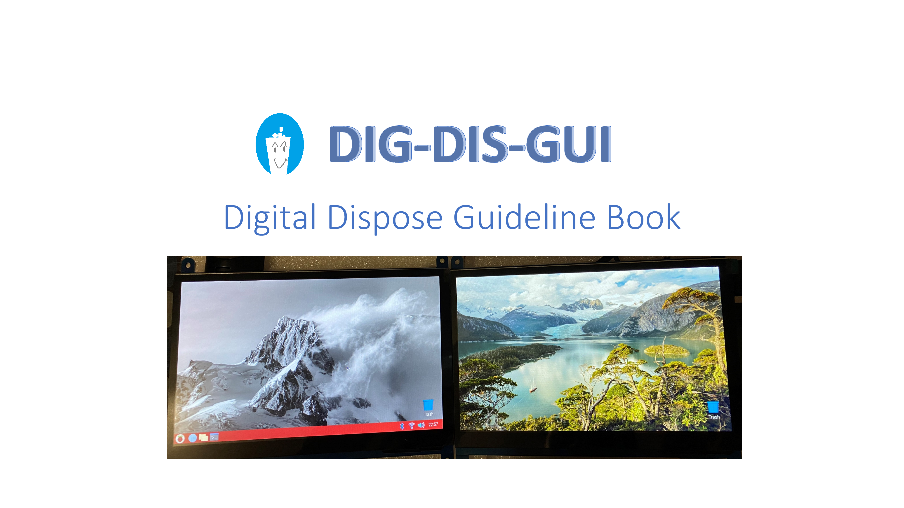

# Digital_Dispose_Guidline_Device

The idea behind making this device is to upgrade the old style trash guidelines paper book to a smart device.

As everything today is transferring to digital, so we planned to change that old style paper trash guideline book to a digital 
device. This device will look like a book, but rather that pages, it will have two 7 inches touch screens that will let user 
to interact with device.

We will use raspberry pi 4 as a processor and battery to make this device portable. This device will consist of two sections, 
one will show all the trash guidelines and another will show list of daily use items and showing which bin those belongs to.

Both screens will be binded together with spiral binding, which will make user to close and open this device like traditional
books. Also by this, device will look like a book but it will be "digital".
